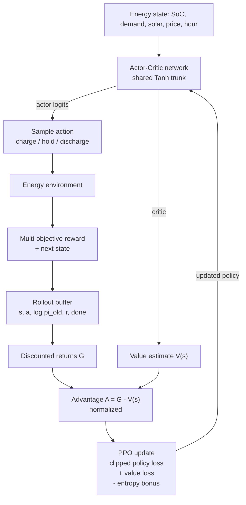
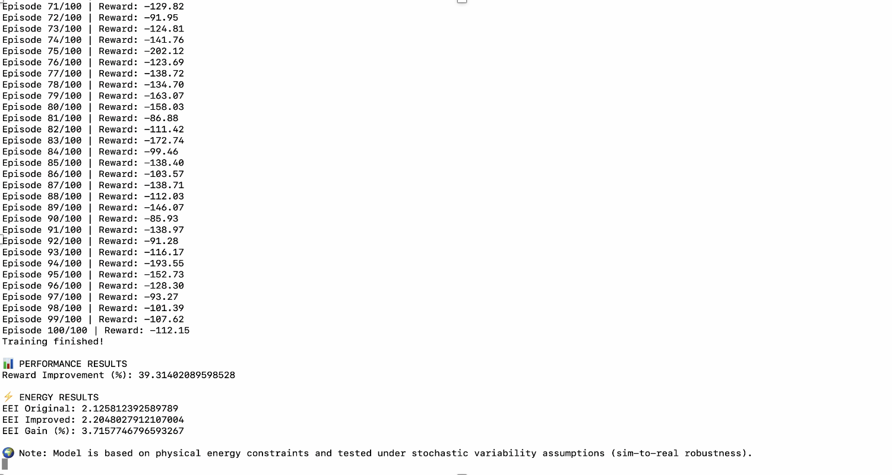

# GREENIT — Energy Management Optimization with PPO

**3rd Place — GREENIT Hackathon, UM6P**

A PPO reinforcement-learning agent for battery energy-storage control: it decides when to
charge from solar, when to discharge to the load, and when to draw from the grid. The
contribution is not a new algorithm but the **reward design** — replacing a single
electricity-cost objective with a multi-objective signal covering renewable utilization,
battery wear, unserved demand and peak-hour grid import.


## Project Status

| Component | Status |
| --- | --- |
| PPO agent — `src/ppo_agent.py` | Implemented and runnable |
| Reward functions — `src/reward_functions.py` | Recovered verbatim from the hackathon screenshot |
| Environment integration — `incomplete/` | One `step()` fragment; the simulation environment was not preserved |

The PPO agent and the reward functions run and can be inspected independently. End-to-end
training cannot be reproduced from this repository — see
[Usage → Current state](#current-state) for exactly what is missing.

## Overview

A building or micro-grid with solar panels and a battery has to choose, at every timestep,
where its energy comes from. The right choice depends on demand, solar generation, the
price signal, the battery's state of charge and the time of day, and a decision that looks
cheap right now can be expensive an hour later. That makes it a sequential decision problem
under uncertainty — the kind reinforcement learning is built for.

PPO is a well-established, stable policy-gradient method, so this project treats the
algorithm as a fixed component and puts the effort into the objective instead. The reward
function is where domain knowledge enters an RL system: the same PPO implementation
produces very different behavior depending on what it is paid for. Improving the objective
of an existing algorithm can change system behavior substantially without inventing a new
algorithm.

## Approach

The prototype started from a cost-only reward:

```python
def compute_reward_original(grid_energy, price):
    return -(grid_energy * price)
```

Minimize the cost of imported grid energy, and nothing else. An agent optimizing this has
no incentive to actually meet demand (not serving load is free), no reason to avoid wasting
solar generation, no notion of battery wear, and no awareness of *when* during the day it
draws power.

The improved reward keeps cost as one term among several, with hand-tuned weights. Every
term below is present in `src/reward_functions.py`:

| Objective | How it enters the reward | Weight |
| --- | --- | --- |
| **Renewable utilization** | Reward the share of demand served locally by solar + battery | +3.5 |
| **Reliability** | Penalize unserved demand — the heaviest term | −3.0 |
| **Electricity cost** | Penalize `grid_energy × price` | −1.5 |
| **Grid charging** | Penalize filling the battery from the grid | −0.7 |
| **Safe operating band** | Flat penalty when state of charge leaves `[0.15, 0.95]` | −0.5 |
| **Peak-hour consumption** | Extra cost penalty during peak hours | −0.5 |
| **Renewable curtailment** | Penalize wasted solar generation | −0.4 |
| **Battery health** | Penalize total charge/discharge throughput (cycling) | −0.05 |

The relative magnitudes encode a priority ordering: keeping the lights on beats saving
money, which beats avoiding curtailment, which beats sparing the battery.

**Grid stability** is addressed only indirectly, through the peak-hour and grid-charging
penalties. There is no explicit frequency, voltage or ramp-rate model here.

**Provenance:** both reward functions in `src/reward_functions.py` were transcribed
verbatim from the surviving hackathon screenshot
([`results/reward-function-baseline-vs-improved.png`](results/reward-function-baseline-vs-improved.png)),
because the original `.py` file was not preserved. The coefficients and term structure are
the original ones; nothing was re-tuned. Full breakdown in
[`docs/reward-design.md`](docs/reward-design.md).

## PPO Architecture

`ActorCritic` is a shared two-layer Tanh trunk with two heads: the **actor** emits logits
over a discrete action set (charge / hold / discharge levels), and the **critic** emits a
scalar state-value baseline. The update uses the standard clipped-surrogate objective, a
squared-error value loss for the critic, and an entropy bonus to keep the agent exploring.



Implementation details — the probability ratio, advantage handling, hyperparameters and the
original training-loop pseudocode — are in [`docs/ppo.md`](docs/ppo.md).

## Results

Captured during the hackathon and reproduced exactly as recorded. No additional experiments
have been run.


### Reported Results



Console output from a 100-episode training run comparing the two reward formulations:

| Reported metric | Value |
| --- | --- |
| EEI, original reward | 2.1258 |
| EEI, improved reward | 2.2048 |
| **EEI gain** | **3.72 %** |
| Reward improvement | 39.31 % |

The **EEI gain is the meaningful figure**, because it is measured independently of the
reward being optimized. The 39.31 % reward improvement is *not* directly comparable: the
two agents optimize different objectives, so their reward values are on different scales
and a higher number does not by itself mean better energy management.

`EEI` appears under "ENERGY RESULTS" in the captured output, but neither its expansion nor
its formula was preserved anywhere in this repository, so the metric is reported here
exactly as recorded rather than interpreted. The run also notes that the model was "based on
physical energy constraints and tested under stochastic variability assumptions
(sim-to-real robustness)".

### Presentation


The "Our Solution" slide: PPO adapted to the Moroccan grid context, with the custom reward function as the stated contribution, citing Schulman et al., *Proximal Policy
Optimization* (2017).

## Hackathon

Built for the **GREENIT hackathon**, hosted with UM6P Student Organizations, Leadership &
Engagement, on the theme *"AI and Digitalization at the Service of Intelligent Energy
Storage and Green Tech Sustainable Resource Management"*. The energy-storage framing and the
Moroccan grid context come from that event, and the prototype was built inside its time
limit.

The project placed **3rd**.

## Repository Structure

```
.
├── README.md
├── requirements.txt          
├── src/
│   ├── __init__.py
│   ├── ppo_agent.py              
│   └── reward_functions.py       
├── incomplete/
│   ├── README.md                
│   └── environment_step.py       
├── docs/
│   ├── ppo.md                   
│   └── reward-design.md         
├── results/
│   ├── reward-function-baseline-vs-improved.png
│   ├── training-and-evaluation-output.png
│   └── hackathon-presentation.png
├── demo/
│   └── README.md
└── tests/
    └── test_smoke.py             

## Installation

```bash
git clone https://github.com/<your-username>/greenit-energy-optimization.git
cd greenit-energy-optimization
python -m venv .venv
source .venv/bin/activate
pip install -r requirements.txt
```

Only PyTorch is required. The reward functions are pure Python and import without it.

## Usage

### What runs today

The smoke tests, which import both modules and perform one real PPO update on synthetic
rollout data:

```bash
python tests/test_smoke.py
```

Using the components directly:

```python
from src.ppo_agent import PPOAgent
from src.reward_functions import compute_reward_improved

agent = PPOAgent(state_dim=6, action_dim=3)

# Collect rollouts with agent.model.get_action(state), score them with
# compute_reward_improved(...), then:
agent.update(memory)   # memory: states, actions, log_probs, rewards, dones
```

The expected shape of `memory` is documented in [`docs/ppo.md`](docs/ppo.md).

### Current state

There is no training script, because the simulation environment the agent was trained
against — demand profile, solar generation, price signal and battery model — was not saved
after the hackathon. All that survives of it is a single `step()` method, preserved
unmodified in [`incomplete/`](incomplete/README.md), which calls a `compute_reward(...)`
variant whose signature matches neither function in `src/`; the two came from different
iterations of the design.

Both `src/` modules are complete and run on their own; connecting them into an end-to-end
training run requires rebuilding the environment first, which is the first item under
[Future Improvements](#future-improvements).

## Tech Stack

- **Python 3.9+**
- **PyTorch** — `torch.nn`, `torch.optim.Adam`, `torch.distributions.Categorical`
- **Reinforcement learning** — PPO with a clipped surrogate objective, actor-critic
  architecture, discrete action space

No other libraries are used, and there is no dataset in this repository.

## Key Takeaways

- **The objective, not the architecture, drove the change in behavior.** PPO was used
  exactly as published. In an applied RL problem, time spent specifying *what* to optimize
  pays off faster than time spent on the network.
- **A single-objective reward is easy to game.** Minimizing `grid_energy × price` can be
  satisfied by not serving load at all. An unserved-demand penalty larger than the cost term
  was needed before the objective described the actual task.
- **Competing objectives make evaluation the hard part.** Cheap energy, high renewable
  utilization, low battery wear and peak shaving pull against each other, so the weights are
  an explicit statement of priority. And because reward values from two different
  formulations are not comparable, a reward-independent metric is required to claim any
  improvement at all.

## Future Improvements

Not implemented; this is a roadmap, not a feature list.

- **Rebuild a reproducible simulation environment** with an explicit battery model, demand
  and solar profiles, and a documented price signal — the prerequisite for everything else.
- **Benchmark against baseline policies** (rule-based charge-when-cheap, greedy
  self-consumption, and a no-battery baseline) using a reward-independent metric.
- **Test alternative reward formulations**, including treating the eight weights as a
  hyperparameter search rather than hand-tuned constants, and using `prev_soc` for an
  explicit state-of-charge-change penalty.
- **Improve demand and renewable forecasting** and feed the forecast into the state, so the
  agent anticipates rather than reacts.
- **Model battery degradation** properly instead of proxying wear with throughput.
- **Upgrade the RL machinery**: GAE(λ) advantages, gradient clipping, a learning-rate
  schedule, and evaluation over multiple seeds with confidence intervals.
- **Add experiment tracking** so runs and reward variants stay comparable after the fact.

## Team / Credits

Developed by my team of four members during the GREENIT hackathon:

- SOUKAINA EL KESSIRI 
- SOUKAINA EL JAOUHARI
- HIBA CHGOURI
- NOUHA TALSSI

Credits:

- **PPO algorithm** — Schulman, Wolski, Dhariwal, Radford, Klimov, *Proximal Policy
  Optimization Algorithms*, 2017 ([arXiv:1707.06347](https://arxiv.org/abs/1707.06347)).
  The implementation here was written for this project; the method is theirs.
- **Problem statement and energy-storage framing** — provided by the GREENIT hackathon
  organizers and UM6P. No starter code or dataset from the organizers is included here.


